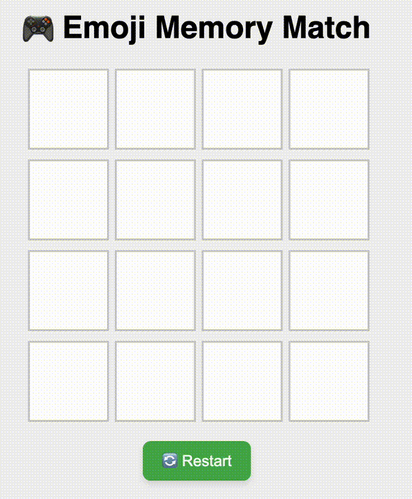

# 🧠 Emoji Memory Game 🎮

A fun and simple browser-based memory matching game built with **TypeScript**, **HTML**, and **CSS**. Click on emoji cards to reveal them, and try to match all the pairs!


<p align="center">
  
</p>

## 🚀 Live Demo

👉 [Play it on GitHub Pages](https://tshreegupta.github.io/emoji-memory-game/)


## 🛠️ Tech Stack

- **TypeScript** – game logic
- **HTML/CSS** – UI and layout
- **GitHub Actions** – for automated deployment
- **GitHub Pages** – for hosting the game live


## 🔧 Setup Instructions

### 1. Clone the repo

```bash
git clone https://github.com/tshreegupta/emoji-memory-game.git
cd emoji-memory-game
```
### 2. Install Dependencies:

```bash
npm install
```

### 3. Run Locally

```bash
npm run build    # Compile TypeScript
npm run start    # Serve the app locally (via `serve`)
```

Then open http://localhost:3000 in your browser.
